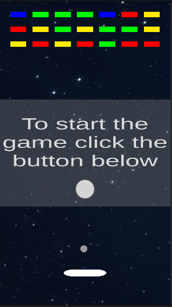
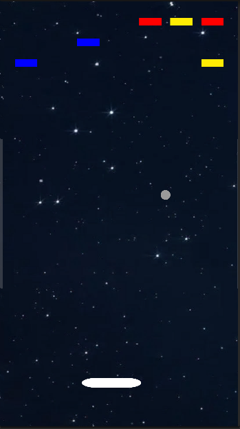

# Brick Breaker

## Опис гри
**Brick Breaker** — це класична аркадна гра, в якій гравець керує платформою внизу екрана та відбиває м'ячик, щоб знищити всі блоки у верхній частині рівня.  

Головна мета — очистити поле від усіх блоків, не давши м'ячу впасти за межі екрану.  

## Геймплей
- **Платформа** керується за допомогою зажимання лівої клавіші миші і руху вліво або вправо.  
- **М'ячик** відбивається від платформи та блоків.  
- Якщо м'яч падає за нижній край екрана — гравець програє.  

## Технології
- Unity 2021.3.26f1
- C#  
- 2D Physics  

## Скриншоти
  
  

## Як запустити
1. Завантажити репозиторій
2. Відкрити проект у Unity 2021.3.26f1
3. Запустити сцену `MainScene`
